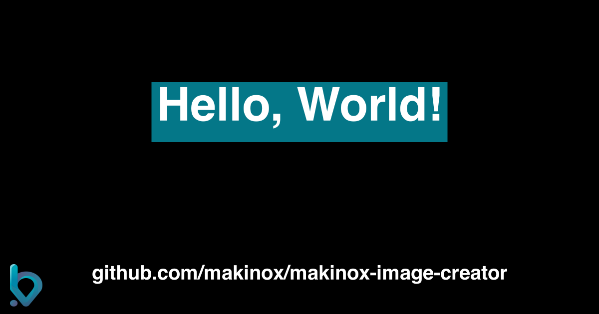

# @makinox/image-creator

A library to create images.

## Used

- Typescript

Link to [image-creator!](https://image-creator.jesusbossa.dev/)



## Example

```ts
import CreateImage from './script/creation';

CreateImage({ filePath: './test.png', extraLogo: './src/assets/B.svg' }).then((created) => console.log({ created }));
```

## Create image options

#### width

> Change canvas width

Type: `number`

Default: `1200`

#### height

> Change canvas height

Type: `number`

Default: `1200`

#### backgroundColor

> Change canvas background color

Type: `string | CanvasGradient | CanvasPattern`

Default: `#000`

#### titleFontStyle

> Change properties of the title

Type: `string`

Default: `bold 70pt Open Sans`

#### textAlign

> Change the alignment of the canvas texts

Type: `CanvasTextAlign`

Default: `center`

#### textTitle

> Change the title of the canvas

Type: `string`

Default: `Hello, World!`

#### titleFillStyle

> Change color of the title background

Type: `string | CanvasGradient | CanvasPattern`

Default: `#047788`

#### titleColor

> Change color of the title

Type: `string | CanvasGradient | CanvasPattern`

Default: `#fff`

#### subTextColor

> Change color of the sub text

Type: `string | CanvasGradient | CanvasPattern`

Default: `#fff`

#### subTextFontStyle

> Change properties of the sub text

Type: `string`

Default: `bold 30pt Open sans`

#### subText

> Change the sub text

Type: `string`

Default: `image-creator.jesusbossa.dev`

#### extraLogo

> Set a logo

Type: `string`

#### filePath

> Set the path of the created file

Type: `string`

## Available Scripts

In the project directory, you can run:

### `yarn start`

Runs the app in the development mode.
